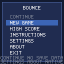
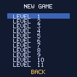
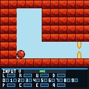
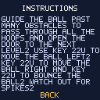
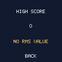
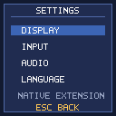
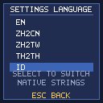
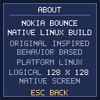

⚠️ **Work in Progress**

> This project is an ongoing native Linux reconstruction of Nokia Bounce.
> It is **not yet complete** and still requires further implementation,
> verification, bug fixing, and refinement. The current build represents
> the present state of the reconstruction and should not be considered a
> final or complete release.

## Screenshots


















# Nokia Bounce Decomp

## Provenance

`src/main/java/com/nokia/mid/appl/boun/` contains **recovered, decompiled Java
reference code**. It is *not* original Nokia source. It was produced by
decompiling a recovered game artifact with JD-Core 1.1.3, so class and member
names are partly obfuscated and the recovered text is a reconstruction rather
than authored source.

The reconstructed native Linux implementation is the code under `native/`. The
Java tree is retained as the reference basis for that reconstruction; it is not
compiled, run, or shipped as part of the native program.

Provenance for every source consulted — the base repository this project derives
from, the external references, and the evidence hierarchy that ranks them — is
recorded in [`reverse/EXTERNAL-SOURCES-REGISTRY.md`](reverse/EXTERNAL-SOURCES-REGISTRY.md).

Attribution: the base repository and recovered Java/resources originate from
[rndtrash/nokia-bounce-decomp](https://github.com/rndtrash/nokia-bounce-decomp).

## Building

It builds with `gradlew build` but there is no point in that at the moment since I didn't implement any wrappers for MIDlet and Nokia APIs.

The native Linux slice builds with the project Makefile, from the repository root:

```
make -C native/app            # produces native/app/bounce_vertical_slice
make -C native/app check      # self-tests; rc=0 and an empty stderr
make -C native/app run        # runs the game
```

The binary must be run from the repository root, because it resolves level and
asset paths relative to it:

```
./native/app/bounce_vertical_slice
```

## Debug tracker (native, optional)

`NBB_DEBUG` turns on the terminal debug tracker. It writes to **stderr** and
changes no gameplay state; the variable is read once at start-up and is ignored
by `--check`.

| `NBB_DEBUG` | level | output |
| --- | --- | --- |
| unset or `0` | disabled | nothing |
| `1` | events | new game, level start/complete, game over, game end, death, respawn, checkpoint, flow transitions, tile events |
| `2` | + state | score, lives, ball size, and the per-tick death `z`/`q` ladder |
| `3` | + verbose | one `[NBB-PLAYER]` state line per simulation tick (~25 lines/s) |

Any other value is treated as disabled. There is no log file and no extra
dependency; only the C runtime `FILE *` is used.

```
NBB_DEBUG=1 ./native/app/bounce_vertical_slice
NBB_DEBUG=2 ./native/app/bounce_vertical_slice
NBB_DEBUG=3 ./native/app/bounce_vertical_slice
```

Each line is prefixed so terminal output stays greppable, e.g.

```
[NBB-EVENT] DEATH tick=1057 lives=2
[NBB-DEATH] tick=1057 z=2 q=7
[NBB-EVENT] RESPAWN tick=1064 level=1 lives=2
```

`tick=N` is the existing `BounceGameTimer.tick_entry_count`, i.e. the real
simulation tick, not a separate counter. Every line is flushed as it is written,
so a crash still leaves the most recent events on the terminal. Level 3 is a
per-tick text stream and is materially more expensive than 0-2; keep it opt-in.

Implementation notes: `native/app/debug_tracker.h`.

## Tools

### extract_locales

`extract_locales.py` -- extracts locales from `lang.***` files.

#### Requirements

 * Python 3 with PIP

#### Usage

```
pip install -r requirements.txt
python extract_locales.py
```

Replace `pip` and `python` with `pip3` and `python3` if your system has Python 2 installed.